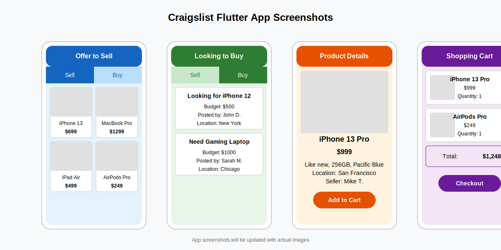

# Craigslist Flutter App

A modern, mobile-first marketplace application built with Flutter and Supabase, implementing clean architecture principles.

## Overview

The Craigslist Flutter App is a marketplace where users can:

- Browse and search for products
- Post items they want to sell
- Post requests for items they're looking to buy
- Manage their listings and requests
- Complete purchases through the app

The app is designed as a micro-app that can be integrated within a parent OneApp.

## Screenshots



## Features

- **Clean Architecture**: Clear separation of concerns with layered architecture
- **Two Main Sections**: "Offer to Sell" and "Looking to Buy" categories
- **User Authentication**: Register, login, and profile management with Supabase
- **Product Listings**: Browse, search, and filter products
- **Looking For Items**: Post and browse requests for items
- **Shopping Cart**: Add products to cart and checkout
- **Notifications**: Real-time notifications for users
- **Image Upload**: Upload and manage product images
- **Location Services**: Find products near you
- **Responsive Design**: Works on mobile, tablet, and desktop

## Getting Started

### Prerequisites

- Flutter SDK (version 3.0.0 or higher)
- Dart SDK (version 3.0.0 or higher)
- Android Studio / VS Code with Flutter extensions
- Git
- Docker and Docker Compose (for local Supabase development)
- iOS Simulator/Android Emulator for mobile testing

### Installation

1. Clone the repository
```bash
git clone https://github.com/rabinderFuturescape/Craiglist-Flutter_app.git
```

2. Navigate to project directory
```bash
cd Craiglist-Flutter_app
```

3. Install dependencies
```bash
flutter pub get
```

4. Start the Supabase local development environment
```bash
docker-compose up -d
```

5. Run the app
```bash
flutter run
```

## Architecture

This project follows Clean Architecture principles with the following layers:

- **Presentation Layer**: UI components, screens, and BLoCs
- **Domain Layer**: Use cases, entities, and repository interfaces
- **Data Layer**: Repository implementations, data sources, and models
- **External Layer**: API services, local storage, and third-party integrations

## Tech Stack

- **Frontend**: Flutter
- **Backend**: Supabase
- **Database**: PostgreSQL
- **State Management**: BLoC
- **Authentication**: Supabase Auth
- **Storage**: Supabase Storage
- **Realtime**: Supabase Realtime

## Documentation

- [Developer Guide](docs/Developer_Guide.md): Comprehensive documentation for developers
- [Getting Started](docs/Getting_Started.md): Quick start guide for new developers
- [Flutter API Guide](docs/Flutter_developer_guide.md): Guide for API integration

## Contributing

Pull requests are welcome. For major changes, please open an issue first to discuss what you would like to change.

## License

[MIT](https://choosealicense.com/licenses/mit/)
