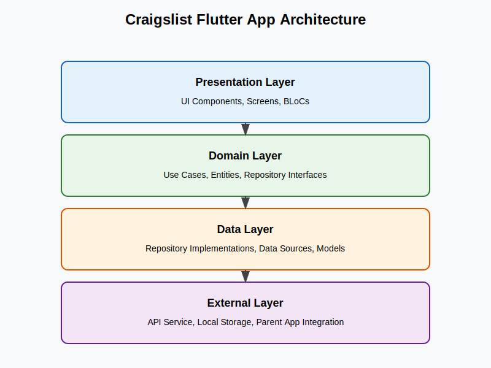
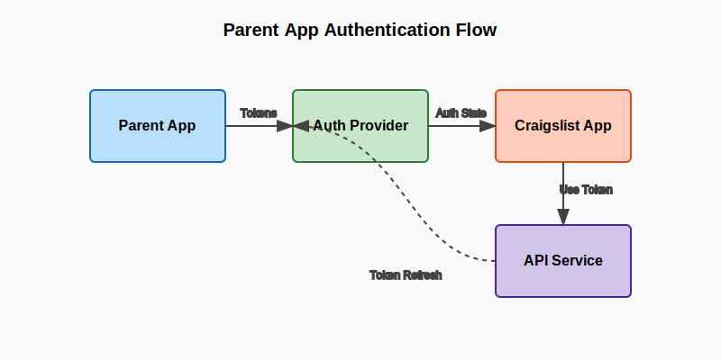

# Craigslist Flutter App - Developer Guide

## Table of Contents

1. [Introduction](#introduction)
2. [Project Overview](#project-overview)
3. [Architecture](#architecture)
4. [Project Structure](#project-structure)
5. [Setup and Installation](#setup-and-installation)
6. [Supabase Backend](#supabase-backend)
7. [Authentication](#authentication)
8. [API Integration](#api-integration)
9. [UI Components](#ui-components)
10. [State Management](#state-management)
11. [Navigation](#navigation)
12. [Testing](#testing)
13. [Deployment](#deployment)
14. [Best Practices](#best-practices)
15. [Troubleshooting](#troubleshooting)
16. [Contributing](#contributing)

## Introduction

The Craigslist Flutter App is a modern, mobile-first marketplace application built with Flutter. It follows clean architecture principles and integrates with Supabase for backend services. This guide provides comprehensive documentation for developers working on the project.

### Key Features

- User authentication and profile management
- Product listings with search and filtering
- "Looking For" listings for buyer requests
- Shopping cart and checkout functionality
- Real-time notifications
- Image upload and management
- Location-based services

## Project Overview

The app is designed as a micro-app that can be integrated within a parent OneApp. It provides a marketplace where users can:

1. Browse and search for products
2. Post items they want to sell
3. Post requests for items they're looking to buy
4. Manage their listings and requests
5. Complete purchases through the app

The UI is organized into two main sections:
- "Offer to Sell" - For product listings
- "Looking to Buy" - For buyer requests

## Architecture

The app follows Clean Architecture principles with a clear separation of concerns:



### Layers

1. **Presentation Layer**
   - UI components, screens, and BLoCs
   - Handles user interaction and display

2. **Domain Layer**
   - Use cases, entities, and repository interfaces
   - Contains business logic and rules

3. **Data Layer**
   - Repository implementations, data sources, and models
   - Handles data retrieval and storage

4. **External Layer**
   - API services, local storage, and third-party integrations
   - Handles external communication

### Design Patterns

- **Repository Pattern**: Abstracts data sources from the rest of the app
- **Dependency Injection**: Provides dependencies to classes
- **BLoC Pattern**: Manages state and business logic
- **Factory Pattern**: Creates objects without specifying their concrete classes

## Project Structure

```
lib/
├── core/                  # Core functionality used across the app
│   ├── config/            # App configuration
│   ├── error/             # Error handling
│   ├── network/           # Network utilities
│   ├── presentation/      # Shared UI components
│   ├── services/          # Core services
│   ├── theme/             # App theme
│   └── utils/             # Utility functions
│
├── features/              # App features
│   ├── auth/              # Authentication feature
│   │   ├── data/          # Data layer
│   │   ├── domain/        # Domain layer
│   │   └── presentation/  # Presentation layer
│   │
│   ├── product/           # Product listing feature
│   │   ├── data/
│   │   ├── domain/
│   │   └── presentation/
│   │
│   ├── looking_for/       # Looking for items feature
│   │   ├── data/
│   │   ├── domain/
│   │   └── presentation/
│   │
│   ├── cart/              # Shopping cart feature
│   │   ├── data/
│   │   ├── domain/
│   │   └── presentation/
│   │
│   └── notification/      # Notifications feature
│       ├── data/
│       ├── domain/
│       └── presentation/
│
└── main.dart              # App entry point
```

## Setup and Installation

### Prerequisites

- Flutter SDK (version 3.0.0 or higher)
- Dart SDK (version 3.0.0 or higher)
- Android Studio / VS Code with Flutter extensions
- Git
- Docker and Docker Compose (for local Supabase development)

### Getting Started

1. Clone the repository:
   ```bash
   git clone https://github.com/rabinderFuturescape/Craiglist-Flutter_app.git
   cd Craiglist-Flutter_app
   ```

2. Install dependencies:
   ```bash
   flutter pub get
   ```

3. Start the Supabase local development environment:
   ```bash
   docker-compose up -d
   ```

4. Run the app:
   ```bash
   flutter run
   ```

### Environment Configuration

The app uses different configurations for development and production environments:

- **Development**: Uses local Supabase instance (http://localhost:8000)
- **Production**: Uses production Supabase instance (configured via environment variables)

## Supabase Backend

The app uses Supabase for backend services, including authentication, database, storage, and realtime updates.

### Local Development Setup

1. Start the Supabase services:
   ```bash
   docker-compose up -d
   ```

2. Access Supabase Studio at http://localhost:3000

3. Apply database migrations:
   ```bash
   cd supabase/migrations
   # Run SQL files in order
   ```

### Database Schema

The database schema includes the following tables:

- **products**: Product listings
- **looking_for_items**: "Looking for" requests
- **cart_items**: Shopping cart items
- **orders**: User orders
- **order_items**: Items within orders
- **notifications**: User notifications
- **profiles**: User profiles

### Row Level Security (RLS)

Supabase uses Row Level Security to control access to data:

- Products and "Looking For" items are viewable by everyone
- Users can only create, update, and delete their own items
- Users can only view and modify their own cart, orders, and notifications

### Storage

Supabase Storage is used for:

- Product images (stored in the 'product_images' bucket)
- User avatars (stored in the 'profiles' bucket)

## Authentication

The app uses Supabase Authentication for user management:



### Authentication Flow

1. User signs up or logs in through the app
2. Supabase Auth validates credentials and returns tokens
3. Tokens are stored securely using Flutter Secure Storage
4. Tokens are automatically refreshed when they expire
5. User session is maintained across app restarts

### Integration with Parent App

Since the app is designed as a micro-app within a parent OneApp, authentication can be delegated to the parent app:

```dart
class ParentAppAuthProvider implements AuthProvider {
  final ParentAppAuthService _parentAuthService;
  
  ParentAppAuthProvider(this._parentAuthService);
  
  @override
  Future<String?> getAccessToken() async {
    // Get token from parent app
    return await _parentAuthService.getToken();
  }
  
  @override
  Future<bool> isAuthenticated() async {
    return await _parentAuthService.isLoggedIn();
  }
  
  @override
  Future<void> onAuthFailure() async {
    // Notify parent app of auth failure
    await _parentAuthService.handleAuthFailure();
  }
}
```

## API Integration

### Supabase Client

The app uses a custom `AppSupabaseClient` class to interact with Supabase:

```dart
class AppSupabaseClient {
  static final AppSupabaseClient _instance = AppSupabaseClient._internal();
  
  factory AppSupabaseClient() {
    return _instance;
  }
  
  AppSupabaseClient._internal();
  
  static Future<void> initialize() async {
    await Supabase.initialize(
      url: _getSupabaseUrl(),
      anonKey: _getSupabaseAnonKey(),
      debug: kDebugMode,
      authOptions: const FlutterAuthClientOptions(
        authFlowType: AuthFlowType.pkce,
      ),
    );
  }
  
  static AppSupabaseClient get instance => _instance;
  
  Supabase get client => Supabase.instance;
}
```

### Data Sources

Data sources handle communication with the Supabase backend:

- **ProductSupabaseDataSource**: Handles product-related operations
- **LookingForSupabaseDataSource**: Handles "looking for" item operations
- **SupabaseAuthService**: Handles authentication operations

Example of a data source method:

```dart
Future<List<Product>> getProducts({
  int page = 1,
  int pageSize = 20,
  Map<String, dynamic>? filters,
}) async {
  try {
    // Start with the base query
    var query = _supabaseClient.db('products')
        .select()
        .order('created_at', ascending: false)
        .range((page - 1) * pageSize, page * pageSize - 1);

    // Apply filters if provided
    if (filters != null) {
      if (filters.containsKey('category')) {
        query = query.contains('categories', [filters['category']]);
      }
      // More filters...
    }

    final response = await query;
    
    if (response.error != null) {
      throw ServerException(message: response.error!.message);
    }

    return (response.data as List)
        .map((json) => Product.fromJson(json))
        .toList();
  } catch (e) {
    throw ServerException(message: e.toString());
  }
}
```

### Error Handling

The app uses a consistent approach to error handling:

1. Data sources throw specific exceptions (ServerException, AuthException, etc.)
2. Repositories catch exceptions and return Either<Failure, Success>
3. BLoCs handle failures and update the UI accordingly

## UI Components

### Main Navigation

The app uses a tab-based navigation with two main sections:

1. **Offer to Sell**: Displays product listings
2. **Looking to Buy**: Displays "looking for" items

```dart
class MainNavigationPage extends StatefulWidget {
  const MainNavigationPage({Key? key}) : super(key: key);

  @override
  State<MainNavigationPage> createState() => _MainNavigationPageState();
}

class _MainNavigationPageState extends State<MainNavigationPage> with SingleTickerProviderStateMixin {
  late TabController _tabController;

  @override
  void initState() {
    super.initState();
    _tabController = TabController(length: 2, vsync: this);
  }

  @override
  Widget build(BuildContext context) {
    return Scaffold(
      appBar: AppBar(
        title: const Text('Craigslist Flutter App'),
        bottom: TabBar(
          controller: _tabController,
          tabs: const [
            Tab(
              icon: Icon(Icons.sell),
              text: 'Offer to Sell',
            ),
            Tab(
              icon: Icon(Icons.search),
              text: 'Looking to Buy',
            ),
          ],
        ),
      ),
      body: TabBarView(
        controller: _tabController,
        children: const [
          ProductListingTabView(),
          LookingForTabView(),
        ],
      ),
    );
  }
}
```

### Reusable Components

The app includes several reusable UI components:

- **AppBarWidget**: Customizable app bar
- **SearchFilterBar**: Search and filter bar for listings
- **ProductCard**: Card for displaying product information
- **LookingForCard**: Card for displaying "looking for" items
- **LoadingIndicator**: Loading spinner
- **ErrorDisplay**: Error message display

## State Management

The app uses the BLoC (Business Logic Component) pattern for state management:

### BLoC Structure

Each feature has its own BLoC with:

- **Events**: Represent user actions or system events
- **States**: Represent the UI state
- **BLoC**: Handles events and emits states

Example of a BLoC:

```dart
class ProductBloc extends Bloc<ProductEvent, ProductState> {
  final ProductRepository productRepository;

  ProductBloc({required this.productRepository})
      : super(const ProductInitial()) {
    on<LoadProducts>(_onLoadProducts);
    on<ToggleViewMode>(_onToggleViewMode);
    // More event handlers...
  }

  Future<void> _onLoadProducts(
    LoadProducts event,
    Emitter<ProductState> emit,
  ) async {
    emit(const ProductLoading());
    final result = await productRepository.getProducts();
    result.fold(
      (failure) => emit(ProductError(message: failure.message)),
      (products) => emit(ProductLoaded(products: products)),
    );
  }

  // More event handlers...
}
```

### Dependency Injection

The app uses a simple service locator pattern for dependency injection:

```dart
// In main.dart
void main() async {
  WidgetsFlutterBinding.ensureInitialized();
  
  // Initialize Supabase
  await AppSupabaseClient.initialize();
  
  final sharedPreferences = await SharedPreferences.getInstance();

  // Set up dependencies
  final secureStorage = SecureStorageService();
  final tokenManager = TokenManager(secureStorage: secureStorage);
  await tokenManager.initialize();

  // More dependencies...

  runApp(MyApp(
    // Provide dependencies to the app
  ));
}
```

## Navigation

The app uses Flutter's navigation system with named routes:

```dart
MaterialApp(
  title: 'Craigslist Flutter App',
  theme: AppTheme.lightTheme,
  darkTheme: AppTheme.darkTheme,
  debugShowCheckedModeBanner: false,
  home: const MainNavigationPage(),
  routes: {
    '/home': (context) => const MainNavigationPage(),
    '/products': (context) => const ProductListingPage(),
    '/cart': (context) => const CartPage(),
    '/looking-for': (context) => const LookingForListPage(),
  },
)
```

### Deep Linking

The app supports deep linking to specific screens:

1. Product details: `/products/{id}`
2. Looking for item details: `/looking-for/{id}`
3. Cart: `/cart`
4. Profile: `/profile`

## Testing

### Unit Testing

Unit tests focus on testing individual components in isolation:

```dart
void main() {
  late MockProductRepository mockProductRepository;
  late ProductBloc productBloc;

  setUp(() {
    mockProductRepository = MockProductRepository();
    productBloc = ProductBloc(productRepository: mockProductRepository);
  });

  test('initial state should be ProductInitial', () {
    expect(productBloc.state, const ProductInitial());
  });

  blocTest<ProductBloc, ProductState>(
    'emits [ProductLoading, ProductLoaded] when LoadProducts is added and successful',
    build: () {
      when(mockProductRepository.getProducts())
          .thenAnswer((_) async => Right([Product(...)]));
      return productBloc;
    },
    act: (bloc) => bloc.add(const LoadProducts()),
    expect: () => [
      const ProductLoading(),
      isA<ProductLoaded>(),
    ],
  );
}
```

### Widget Testing

Widget tests focus on testing UI components:

```dart
void main() {
  testWidgets('ProductCard displays product information correctly', (WidgetTester tester) async {
    final product = Product(
      id: '1',
      title: 'Test Product',
      price: 100.0,
      // More properties...
    );

    await tester.pumpWidget(MaterialApp(
      home: Scaffold(
        body: ProductCard(product: product),
      ),
    ));

    expect(find.text('Test Product'), findsOneWidget);
    expect(find.text('\$100.0'), findsOneWidget);
  });
}
```

### Integration Testing

Integration tests focus on testing the interaction between components:

```dart
void main() {
  IntegrationTestWidgetsFlutterBinding.ensureInitialized();

  testWidgets('User can add product to cart', (WidgetTester tester) async {
    await tester.pumpWidget(MyApp());

    // Navigate to product details
    await tester.tap(find.byType(ProductCard).first);
    await tester.pumpAndSettle();

    // Add to cart
    await tester.tap(find.byType(ElevatedButton));
    await tester.pumpAndSettle();

    // Verify cart badge shows 1 item
    expect(find.text('1'), findsOneWidget);
  });
}
```

## Deployment

### Android

1. Update the version in `pubspec.yaml`
2. Generate a signed APK:
   ```bash
   flutter build apk --release
   ```
3. Upload to Google Play Console

### iOS

1. Update the version in `pubspec.yaml`
2. Generate a signed IPA:
   ```bash
   flutter build ios --release
   ```
3. Upload to App Store Connect using Xcode

### Web

1. Build the web version:
   ```bash
   flutter build web --release
   ```
2. Deploy to your web hosting service

## Best Practices

### Code Style

- Follow the [Effective Dart](https://dart.dev/guides/language/effective-dart) style guide
- Use consistent naming conventions
- Keep methods small and focused
- Use meaningful variable and method names

### Performance

- Use const constructors where possible
- Avoid unnecessary rebuilds
- Use lazy loading for images
- Implement pagination for lists
- Cache network responses

### Security

- Store sensitive data securely using Flutter Secure Storage
- Use HTTPS for all API calls
- Implement proper token management
- Validate user input
- Use Row Level Security in Supabase

## Troubleshooting

### Common Issues

1. **Authentication Issues**
   - Check if tokens are expired
   - Verify that Supabase is running
   - Check network connectivity

2. **API Errors**
   - Check the Supabase logs
   - Verify that the database schema is correct
   - Check if RLS policies are properly configured

3. **UI Issues**
   - Check for widget overflow
   - Verify that the theme is applied correctly
   - Test on different screen sizes

### Debugging Tools

- **Flutter DevTools**: For debugging UI and performance issues
- **Supabase Studio**: For debugging database and authentication issues
- **Network Inspector**: For debugging API calls

## Contributing

### Workflow

1. Create a new branch for your feature or bug fix
2. Make your changes
3. Write tests for your changes
4. Run tests to ensure they pass
5. Submit a pull request

### Code Review

All code changes require a code review before merging:

1. Describe your changes in the pull request
2. Address any feedback from reviewers
3. Ensure all tests pass
4. Get approval from at least one reviewer

### Documentation

Always update documentation when making changes:

1. Update this developer guide if necessary
2. Add comments to your code
3. Update the API documentation if you change the API
