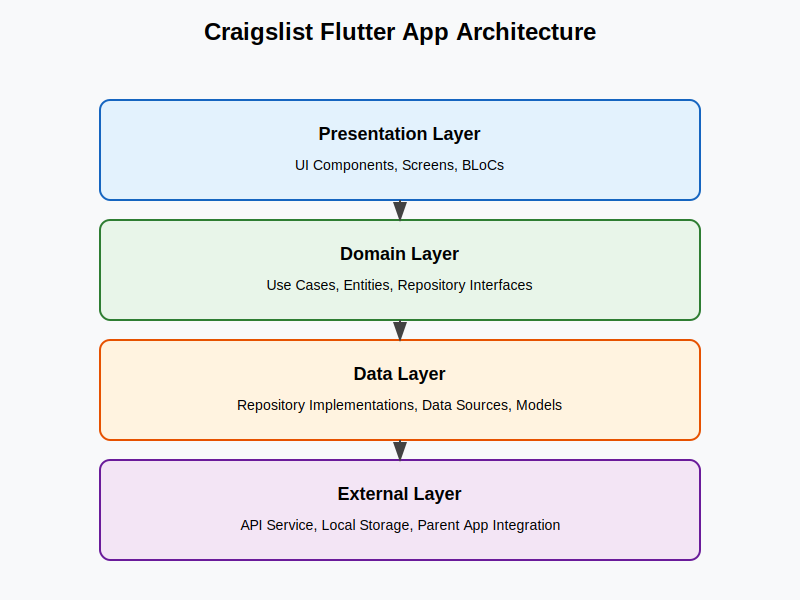
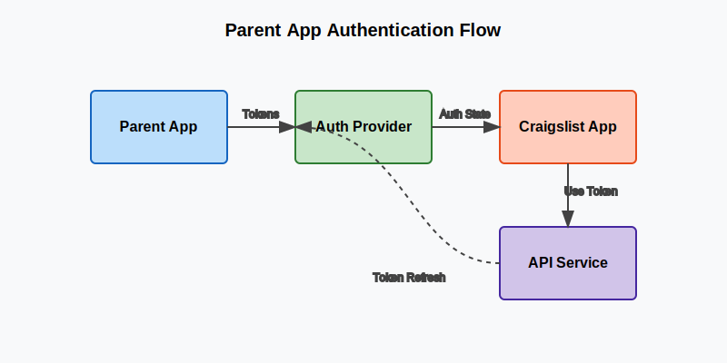

# Flutter API Guide: Craigslist Micro-App Integration

## Table of Contents

1. [Introduction](#introduction)
2. [Architecture Overview](#architecture-overview)
3. [Authentication & Authorization](#authentication--authorization)
   - [Parent App Authentication Integration](#parent-app-authentication-integration)
   - [Token Management](#token-management)
   - [Secure Storage](#secure-storage)
4. [API Integration](#api-integration)
   - [API Service](#api-service)
   - [Error Handling](#error-handling)
   - [Retry Mechanism](#retry-mechanism)
5. [Repository Pattern](#repository-pattern)
   - [Data Sources](#data-sources)
   - [Repositories](#repositories)
6. [Database Interactions](#database-interactions)
7. [Dependency Injection](#dependency-injection)
8. [Testing the API](#testing-the-api)
9. [Best Practices](#best-practices)
10. [Troubleshooting](#troubleshooting)

## Introduction

This guide provides a comprehensive overview of the API architecture for the Craigslist Flutter micro-app, which is designed to be integrated within a parent OneApp. The guide covers authentication handling, database interactions, repository pattern implementation, and best practices for developers working on the project.

The Craigslist Flutter app follows clean architecture principles, implementing the repository pattern and dependency injection to ensure maintainable, testable code with clear separation of concerns.

## Architecture Overview

The app follows a clean architecture approach with the following layers:

1. **Presentation Layer**: UI components, screens, and BLoCs
2. **Domain Layer**: Use cases, entities, and repository interfaces
3. **Data Layer**: Repository implementations, data sources, and models

The API integration is primarily handled in the data layer, with the following key components:

- **API Service**: Handles HTTP requests to the backend
- **Token Manager**: Manages authentication tokens
- **Repositories**: Implement business logic and error handling
- **Data Sources**: Provide data from remote (API) or local sources



## Authentication & Authorization

### Parent App Authentication Integration

Since the Craigslist app is a micro-app within a parent OneApp, authentication is handled through integration with the parent app's authentication system. Here's how it works:

```dart
// Example of how to integrate with parent app authentication
class ParentAppAuthProvider implements AuthProvider {
  final ParentAppAuthService _parentAuthService;

  ParentAppAuthProvider(this._parentAuthService);

  @override
  Future<String?> getAccessToken() async {
    // Get token from parent app
    return await _parentAuthService.getToken();
  }

  @override
  Future<bool> isAuthenticated() async {
    return await _parentAuthService.isLoggedIn();
  }

  @override
  Future<void> onAuthFailure() async {
    // Notify parent app of auth failure
    await _parentAuthService.handleAuthFailure();
  }
}
```

To implement this integration:

1. Create a channel to communicate with the parent app
2. Register for authentication events from the parent app
3. Use the parent app's authentication tokens for API requests
4. Delegate authentication failures to the parent app



### Token Management

The `TokenManager` class handles all aspects of token lifecycle:

```dart
class TokenManager {
  final SecureStorageService _secureStorage;

  TokenManager({required SecureStorageService secureStorage})
      : _secureStorage = secureStorage;

  Future<void> saveTokens({
    required String accessToken,
    required String refreshToken,
    required DateTime expiryTime,
  }) async {
    await _secureStorage.saveToken(accessToken);
    await _secureStorage.saveRefreshToken(refreshToken);
    await _secureStorage.saveTokenExpiryTime(expiryTime.toIso8601String());

    _scheduleTokenRefresh(expiryTime);
    _authStateController.add(true);
  }

  Future<String?> getAccessToken() async {
    final token = await _secureStorage.getToken();
    if (token == null) return null;

    final expiryTimeStr = await _secureStorage.getTokenExpiryTime();
    if (expiryTimeStr == null) return token;

    final expiryTime = DateTime.parse(expiryTimeStr);
    if (DateTime.now().isAfter(expiryTime)) {
      // Token is expired, try to refresh
      return await refreshToken();
    }

    return token;
  }

  Future<String?> refreshToken() async {
    try {
      final refreshToken = await _secureStorage.getRefreshToken();
      if (refreshToken == null) return null;

      // In production, implement actual API call to refresh token
      // For now, we'll simulate a successful refresh
      final newToken = 'refreshed_token_${DateTime.now().millisecondsSinceEpoch}';
      final expiryTime = DateTime.now().add(const Duration(hours: 1));

      await _secureStorage.saveToken(newToken);
      await _secureStorage.saveTokenExpiryTime(expiryTime.toIso8601String());

      _scheduleTokenRefresh(expiryTime);

      return newToken;
    } catch (e) {
      debugPrint('Failed to refresh token: $e');
      return null;
    }
  }
}
```

### Secure Storage

The `SecureStorageService` provides secure storage for sensitive data:

```dart
class SecureStorageService {
  static const String _tokenKey = 'auth_token';
  static const String _refreshTokenKey = 'refresh_token';
  static const String _userIdKey = 'user_id';
  static const String _userDataKey = 'user_data';
  static const String _tokenExpiryKey = 'token_expiry';

  final FlutterSecureStorage _storage;

  SecureStorageService({FlutterSecureStorage? storage})
      : _storage = storage ?? const FlutterSecureStorage();

  Future<void> saveToken(String token) async {
    await _storage.write(key: _tokenKey, value: token);
  }

  Future<String?> getToken() async {
    return await _storage.read(key: _tokenKey);
  }

  // Additional methods for other secure data...
}
```

## API Integration

### API Service

The `ApiService` class is responsible for making HTTP requests to the backend:

```dart
class ApiService {
  final String baseUrl;
  final http.Client _client;
  final SecureStorageService _secureStorage;
  final TokenManager _tokenManager;

  ApiService({
    this.baseUrl = 'https://api.craigslist-app.example.com/v1',
    http.Client? client,
    required SecureStorageService secureStorage,
    required TokenManager tokenManager,
  })  : _client = client ?? http.Client(),
        _secureStorage = secureStorage,
        _tokenManager = tokenManager;

  Future<Map<String, String>> _getHeaders() async {
    final token = await _tokenManager.getAccessToken();
    return {
      'Content-Type': 'application/json',
      if (token != null) 'Authorization': 'Bearer $token',
    };
  }

  Future<List<Product>> getProducts({
    int page = 1,
    int pageSize = 20,
    Map<String, dynamic>? filters,
  }) async {
    try {
      final queryParams = {
        'page': page.toString(),
        'pageSize': pageSize.toString(),
        if (filters != null) ...filters,
      };

      final headers = await _getHeaders();
      final response = await _client.get(
        Uri.parse('$baseUrl/products').replace(queryParameters: queryParams),
        headers: headers,
      );

      if (response.statusCode == 200) {
        final List<dynamic> data = json.decode(response.body);
        return data.map((json) => Product.fromJson(json)).toList();
      } else {
        _handleApiError(response);
        return [];
      }
    } catch (e) {
      throw ServerFailure(message: 'Failed to get products: $e');
    }
  }

  // Additional API methods...
}
```

### Error Handling

The API service includes robust error handling:

```dart
void _handleApiError(http.Response response) {
  final statusCode = response.statusCode;

  try {
    final errorBody = json.decode(response.body);
    final errorMessage = errorBody['message'] ?? 'Unknown error';

    if (statusCode == 401) {
      throw AuthFailure(message: errorMessage);
    } else if (statusCode >= 500) {
      throw ServerFailure(
        message: errorMessage,
        code: statusCode,
      );
    } else {
      throw ServerFailure(
        message: errorMessage,
        code: statusCode,
      );
    }
  } catch (e) {
    if (e is AuthFailure || e is ServerFailure) {
      rethrow;
    }

    // If we can't parse the error body, use a generic message
    if (statusCode == 401) {
      throw const AuthFailure(message: 'Authentication failed');
    } else if (statusCode >= 500) {
      throw ServerFailure(
        message: 'Server error',
        code: statusCode,
      );
    } else {
      throw ServerFailure(
        message: 'Request failed with status: $statusCode',
        code: statusCode,
      );
    }
  }
}
```

### Retry Mechanism

For handling token expiration, the API service includes a retry mechanism:

```dart
Future<http.Response> _retryWithRefreshedToken(
  Future<http.Response> Function() requestFunction
) async {
  // Try to refresh the token
  final refreshedToken = await _tokenManager.refreshToken();
  if (refreshedToken == null) {
    // If refresh fails, throw auth failure
    throw const AuthFailure(message: 'Token refresh failed');
  }

  // Retry the original request with the new token
  return await requestFunction();
}
```

## Repository Pattern

### Data Sources

Data sources are responsible for fetching data from a specific source (remote API or local database):

```dart
abstract class ProductRemoteDataSource {
  Future<List<Product>> getProducts({
    int page = 1,
    int pageSize = 20,
    Map<String, dynamic>? filters,
  });

  Future<Product> getProductById(String id);

  Future<Product> createProduct(Product product);

  Future<Product> updateProduct(String id, Product product);

  Future<void> deleteProduct(String id);

  Future<List<Product>> searchProducts(String query);
}

class ProductRemoteDataSourceImpl implements ProductRemoteDataSource {
  final ApiService _apiService;

  ProductRemoteDataSourceImpl({required ApiService apiService})
      : _apiService = apiService;

  @override
  Future<List<Product>> getProducts({
    int page = 1,
    int pageSize = 20,
    Map<String, dynamic>? filters,
  }) async {
    return await _apiService.getProducts(
      page: page,
      pageSize: pageSize,
      filters: filters,
    );
  }

  // Additional implementation methods...
}
```

### Repositories

Repositories implement business logic and handle errors:

```dart
class ProductRepositoryImpl implements ProductRepository {
  final ProductRemoteDataSource _remoteDataSource;
  final NetworkInfo _networkInfo;

  ProductRepositoryImpl({
    required ProductRemoteDataSource remoteDataSource,
    required NetworkInfo networkInfo,
  })  : _remoteDataSource = remoteDataSource,
        _networkInfo = networkInfo;

  @override
  Future<Either<Failure, List<Product>>> getProducts({
    int page = 1,
    int pageSize = 20,
    Map<String, dynamic>? filters,
  }) async {
    if (await _networkInfo.isConnected) {
      try {
        final products = await _remoteDataSource.getProducts(
          page: page,
          pageSize: pageSize,
          filters: filters,
        );
        return Right(products);
      } on AuthFailure catch (e) {
        return Left(AuthFailure(message: e.message));
      } on ServerFailure catch (e) {
        return Left(ServerFailure(message: e.message, code: e.code));
      } catch (e) {
        return Left(ServerFailure(message: e.toString()));
      }
    } else {
      return const Left(NetworkFailure(message: 'No internet connection'));
    }
  }

  // Additional implementation methods...
}
```

## Database Interactions

The app uses a combination of remote API data and local storage:

### Remote Data

Remote data is fetched through the API service and cached when appropriate:

```dart
Future<List<Product>> getProducts({
  int page = 1,
  int pageSize = 20,
  Map<String, dynamic>? filters,
}) async {
  try {
    final queryParams = {
      'page': page.toString(),
      'pageSize': pageSize.toString(),
      if (filters != null) ...filters,
    };

    final headers = await _getHeaders();
    final response = await _client.get(
      Uri.parse('$baseUrl/products').replace(queryParameters: queryParams),
      headers: headers,
    );

    if (response.statusCode == 200) {
      final List<dynamic> data = json.decode(response.body);
      final products = data.map((json) => Product.fromJson(json)).toList();

      // Cache products if needed
      await _cacheProducts(products);

      return products;
    } else {
      _handleApiError(response);
      return [];
    }
  } catch (e) {
    throw ServerFailure(message: 'Failed to get products: $e');
  }
}
```

### Local Storage

For offline support and caching, the app uses local storage:

```dart
class ProductLocalDataSourceImpl implements ProductLocalDataSource {
  final SharedPreferences _sharedPreferences;
  static const String CACHED_PRODUCTS_KEY = 'CACHED_PRODUCTS';

  ProductLocalDataSourceImpl({required SharedPreferences sharedPreferences})
      : _sharedPreferences = sharedPreferences;

  @override
  Future<List<Product>> getCachedProducts() async {
    final jsonString = _sharedPreferences.getString(CACHED_PRODUCTS_KEY);
    if (jsonString != null) {
      final List<dynamic> jsonList = json.decode(jsonString);
      return jsonList.map((json) => Product.fromJson(json)).toList();
    }
    return [];
  }

  @override
  Future<void> cacheProducts(List<Product> products) async {
    final List<Map<String, dynamic>> jsonList =
        products.map((product) => product.toJson()).toList();
    await _sharedPreferences.setString(
      CACHED_PRODUCTS_KEY,
      json.encode(jsonList),
    );
  }
}
```

## Dependency Injection

The app uses a simple service locator pattern for dependency injection:

```dart
// In main.dart
void main() async {
  WidgetsFlutterBinding.ensureInitialized();
  final sharedPreferences = await SharedPreferences.getInstance();

  // Set up dependencies
  final secureStorage = SecureStorageService();
  final tokenManager = TokenManager(secureStorage: secureStorage);
  await tokenManager.initialize(); // Initialize token manager

  final apiService = ApiService(
    secureStorage: secureStorage,
    tokenManager: tokenManager
  );

  final networkInfo = kIsWeb
      ? WebNetworkInfo()
      : NetworkInfoImpl(InternetConnectionChecker());

  // Set up data sources
  final productRemoteDataSource = ProductRemoteDataSourceImpl(
    apiService: apiService
  );

  // Set up repositories
  final productRepository = ProductRepositoryImpl(
    remoteDataSource: productRemoteDataSource,
    networkInfo: networkInfo,
  );

  // Run the app with dependencies
  runApp(MyApp(
    productRepository: productRepository,
    // Other dependencies...
  ));
}
```

## Testing the API

### Unit Testing

For unit testing API services and repositories:

```dart
void main() {
  late MockHttpClient mockHttpClient;
  late MockSecureStorageService mockSecureStorage;
  late MockTokenManager mockTokenManager;
  late ApiService apiService;

  setUp(() {
    mockHttpClient = MockHttpClient();
    mockSecureStorage = MockSecureStorageService();
    mockTokenManager = MockTokenManager();
    apiService = ApiService(
      client: mockHttpClient,
      secureStorage: mockSecureStorage,
      tokenManager: mockTokenManager,
    );
  });

  group('getProducts', () {
    test('should return list of products when the response is 200', () async {
      // Arrange
      when(mockTokenManager.getAccessToken())
          .thenAnswer((_) async => 'test_token');

      when(mockHttpClient.get(any, headers: anyNamed('headers')))
          .thenAnswer((_) async => http.Response(
                '[{"id": "1", "title": "Test Product"}]',
                200,
              ));

      // Act
      final result = await apiService.getProducts();

      // Assert
      expect(result, isA<List<Product>>());
      expect(result.length, 1);
      expect(result[0].id, '1');
      expect(result[0].title, 'Test Product');
    });

    test('should throw ServerFailure when the response is not 200', () async {
      // Arrange
      when(mockTokenManager.getAccessToken())
          .thenAnswer((_) async => 'test_token');

      when(mockHttpClient.get(any, headers: anyNamed('headers')))
          .thenAnswer((_) async => http.Response(
                '{"message": "Server error"}',
                500,
              ));

      // Act & Assert
      expect(
        () => apiService.getProducts(),
        throwsA(isA<ServerFailure>()),
      );
    });
  });
}
```

### Integration Testing

For testing the integration with the parent app:

```dart
void main() {
  late MockParentAppAuthService mockParentAppAuthService;
  late ParentAppAuthProvider authProvider;

  setUp(() {
    mockParentAppAuthService = MockParentAppAuthService();
    authProvider = ParentAppAuthProvider(mockParentAppAuthService);
  });

  group('ParentAppAuthProvider', () {
    test('should get token from parent app', () async {
      // Arrange
      when(mockParentAppAuthService.getToken())
          .thenAnswer((_) async => 'parent_app_token');

      // Act
      final token = await authProvider.getAccessToken();

      // Assert
      expect(token, 'parent_app_token');
      verify(mockParentAppAuthService.getToken()).called(1);
    });

    test('should check authentication status from parent app', () async {
      // Arrange
      when(mockParentAppAuthService.isLoggedIn())
          .thenAnswer((_) async => true);

      // Act
      final isAuthenticated = await authProvider.isAuthenticated();

      // Assert
      expect(isAuthenticated, true);
      verify(mockParentAppAuthService.isLoggedIn()).called(1);
    });
  });
}
```

## Best Practices

### Error Handling

1. **Use Failure Classes**: Define specific failure classes for different types of errors
2. **Return Either Type**: Use the `Either` type from the `dartz` package to return either a failure or a success
3. **Handle Network Errors**: Check for network connectivity before making API calls
4. **Retry Mechanism**: Implement retry logic for transient failures

### Authentication

1. **Token Refresh**: Automatically refresh tokens when they expire
2. **Secure Storage**: Store tokens securely using `flutter_secure_storage`
3. **Auth State Management**: Use a stream to broadcast authentication state changes
4. **Parent App Integration**: Delegate authentication to the parent app when appropriate

### API Calls

1. **Timeout Handling**: Set appropriate timeouts for API calls
2. **Pagination**: Implement pagination for list endpoints
3. **Caching**: Cache responses when appropriate
4. **Cancellation**: Support cancelling in-flight requests

### Repository Pattern

1. **Clean Interfaces**: Define clear interfaces for repositories
2. **Single Responsibility**: Each repository should focus on a single domain entity
3. **Error Transformation**: Transform API errors into domain-specific failures
4. **Network Awareness**: Check for network connectivity before making API calls

## Troubleshooting

### Common Issues

1. **Authentication Failures**
   - Check if the token is expired
   - Verify that the parent app authentication is properly integrated
   - Ensure the token refresh mechanism is working

2. **Network Errors**
   - Check internet connectivity
   - Verify API endpoints are correct
   - Check for firewall or proxy issues

3. **Data Parsing Errors**
   - Ensure model classes match the API response structure
   - Add proper error handling for JSON parsing
   - Log the raw response for debugging

### Debugging Tips

1. **Enable Network Logging**
   ```dart
   // Add this to your ApiService constructor
   if (kDebugMode) {
     _client = LoggingClient(client ?? http.Client());
   } else {
     _client = client ?? http.Client();
   }
   ```

2. **Test API Endpoints Independently**
   - Use tools like Postman to test API endpoints
   - Verify request/response formats match expectations

3. **Check Token Validity**
   ```dart
   // Add this debug method to TokenManager
   Future<bool> isTokenValid() async {
     final token = await getAccessToken();
     if (token == null) return false;

     // Make a test API call to verify token
     try {
       final response = await http.get(
         Uri.parse('$baseUrl/auth/verify'),
         headers: {'Authorization': 'Bearer $token'},
       );
       return response.statusCode == 200;
     } catch (e) {
       return false;
     }
   }
   ```
